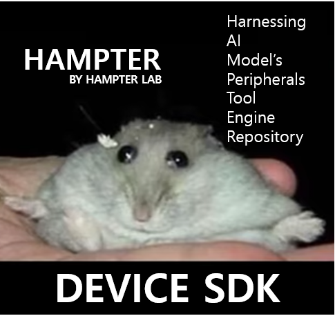

# HAMPTER Device SDK



Reusable ESP32-C3 runtime for HAMPTER devices.

The SDK provides the shared ObjectLink connection, browser provisioning,
credential storage, Tool dispatch, and typed Port runtime. Product firmware
keeps its own hardware drivers, pins, display code, Tools, Ports, and entry
point.

## Requirements

- ESP-IDF 5.5.4
- ESP32-C3
- Arduino Core for ESP32 3.3.10
- ArduinoJson 7.4.2

The component manifest pins the Arduino and ArduinoJson versions.

## Use in a device project

Clone the SDK beside the device repository:

```text
workspace/
├─ HAMPTER-DEVICE_SDK/
└─ MAKES/
   └─ CIRCLE_UI/
```

Import the SDK before ESP-IDF's project setup:

```cmake
cmake_minimum_required(VERSION 3.16)

include("../HAMPTER-DEVICE_SDK/cmake/HampterSdk.cmake")
include($ENV{IDF_PATH}/tools/cmake/project.cmake)

project(my_hampter_device)
```

Then depend on `hampter_device` from the product's component:

```cmake
idf_component_register(
  SRCS "main.cpp"
  INCLUDE_DIRS "."
  REQUIRES hampter_device
)
```

Application code includes `HampterDevice.h`, registers its Tools and Ports,
and calls `HampterDevice::begin()` and `HampterDevice::loop()`.

## Repository layout

```text
cmake/HampterSdk.cmake
components/hampter_device/
diagnostics/tx_power/
```

The SDK intentionally contains no product renderer, physical-button behavior,
or product firmware entry point. Complete device projects live in
[HAMPTER MAKES](https://github.com/Hampterlab/MAKES).
